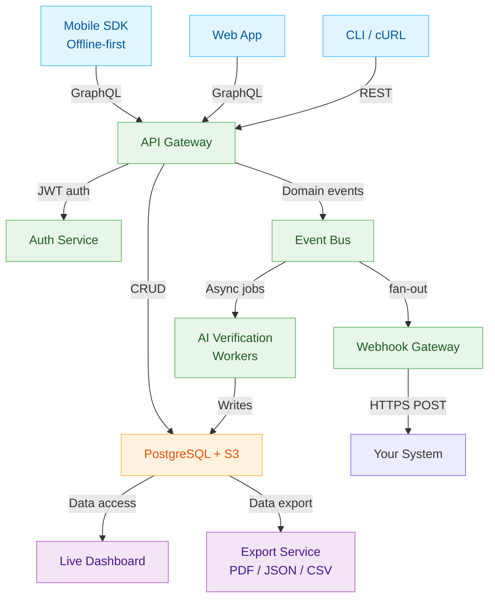

InspectAI uses a **modular, API-first design** where mobile/web clients, AI verification services, and downstream systems communicate through a thin REST + GraphQL layer and an event-driven webhook bus. Field data is captured in an *offline-first* app, verified by low-latency vision models (sub-500 ms), stored in a multi-tenant datastore, and surfaced via real-time dashboards and exports.

## High-Level Component View

*Clients* talk to the **API Gateway**, which exposes both typed GraphQL mutations and path-based REST endpoints for parity with existing Checkfirst products.
When data arrives, the **Event Bus** emits domain events (`job.created`, `image.flagged`, …) that feed the AI workers, dashboards, and webhooks.

## Core Domain Entities

| Entity        | Purpose                                                                              | Key fields                                                        |
|:------------- | :------------------------------------------------------------------------------------ |:----------------------------------------------------------------- |
| **Checklist** | Version-controlled template defining questions, scoring logic, conditional branches. | `id`, `version`, `items[]`, `scoring_rules[]`                     |
| **Job**       | Single execution of a checklist.                                                     | `id`, `checklist_id`, `status`, `score`, `assignee`, `created_at` |
| **Evidence**  | File or structured answer captured during a job.                                     | `id`, `job_id`, `type`, `uri`, `metadata{ gps, exif, signed_at }` |
| **Issue**     | Auto-flagged non-conformity linked to evidence.                                      | `id`, `job_id`, `severity`, `code`, `resolved_at`                 |
| **Report**    | Immutable roll-up of job, issues, signatures, AI verdicts.                           | `id`, `job_id`, `format`, `uri`                                   |

These map 1-to-1 to resources under `/v1/` in the public OpenAPI spec (`/api-reference/openapi.json`).

## Event Lifecycle

| Step                    | Trigger                               | Sync vs Async | Result                                |
|:----------------------- |:------------------------------------- | :------------- |:------------------------------------- |
| **1. Create Job**       | `POST /jobs`                          | Sync          | `job.created` event on bus            |
| **2. Upload Evidence**  | `POST /jobs/:id/evidence`             | Sync          | `evidence.received` event             |
| **3. AI Verification**  | Bus consumer                          | Async         | `image.flagged` *or* `image.accepted` |
| **4. Job Completes**    | All checklist items answered & signed | Sync → Async  | `job.completed` event + webhook       |
| **5. Report Finalised** | Export service                        | Async         | PDF/JSON stored, `report.ready` event |

Webhooks are delivered with HMAC signatures and a retry back-off, following best practice guidelines.

## Offline-First Workflow

1. **Local cache** – Checklists and reference data are cached with an on-device SQLite store so inspectors keep working without signal.
2. **Optimistic writes** – Jobs and evidence queue locally; each record gets a provisional UUID until the gateway assigns the canonical ID.
3. **Two-phase sync** – When connectivity resumes, a delta push occurs, followed by a pull to resolve server-side conflicts (timestamp-based “last-writer-wins”).

> **Latency target**: The vision model runs on edge TPU nodes and returns verdicts in ≤ 500 ms p95, matching common real-time AI benchmarks.

## Security & Compliance

| Layer              | Mechanism                                                                      |
|:------------------ | :------------------------------------------------------------------------------ |
| Transport          | TLS 1.3 enforced on all endpoints.                                             |
| Auth               | HTTP basic for machines; JWT (OAuth 2.0) for user sessions.                    |
| Evidence integrity | SHA-256 digests stored with object metadata; tamper-checks on download.        |
| Webhook signing    | HMAC-SHA256 with shared secret + timestamp to prevent replay.  |
| Data residency     | Choose EU-West or US-East bucket during tenant provisioning.                   |
| Certifications     | ISO 27001 and SOC 2 Type II audits scheduled Q3 2025.                          |

## Scalability Notes

* **Horizontal API pods** scale behind an ALB; long-running exports are off-loaded to a worker queue to keep P95 under 75 ms.
* **AI worker pool** uses autoscaling based on GPU utilisation; cold-start < 2 s thanks to container-native checkpoints.
* **Partitioned storage** – Jobs and evidence partition on `tenant_id` + `YYYYMM` to keep the largest tables under 50 GB.
InspectAI’s modular approach means you can pick just the pieces you need—start with digital checklists, then turn on live AI verification, and finally pipe certified reports into your own BI stack.

[1]: https://www.checkfirst.ai/inspectai "InspectAI by Checkfirst | AI-Enhanced Inspections"
[2]: https://www.checkfirst.ai/blog/why-ticc-businesses-choosing-inspectai-for-smarter-inspections-audits "Checkfirst"
[3]: https://en.wikipedia.org/wiki/Webhook "Webhook - Wikipedia"
[4]: https://www.baeldung.com/spring-boot-openapi-api-first-development?utm_source=chatgpt.com "API First Development with Spring Boot and OpenAPI 3.0 - Baeldung"
[5]: https://openapi-generator.tech/docs/usage/?utm_source=chatgpt.com "Usage - OpenAPI Generator"
[6]: https://developer.android.com/topic/architecture/data-layer/offline-first?utm_source=chatgpt.com "Build an offline-first app | App architecture - Android Developers"
[7]: https://hasura.io/blog/design-guide-to-offline-first-apps?utm_source=chatgpt.com "A Design Guide for Building Offline First Apps - Hasura"
[8]: https://success.outsystems.com/documentation/11/building_apps/data_management/mobile_performance_strategies_and_offline_optimization/offline_data_sync_patterns/?utm_source=chatgpt.com "Offline Data Sync Patterns - OutSystems 11 Documentation"
[9]: https://blog.bitsrc.io/design-patterns-for-offline-first-web-apps-5891a4b06f3a?utm_source=chatgpt.com "Design Patterns for Offline First Web Apps | by Ravidu Perera"
[10]: https://www.reddit.com/r/androiddev/comments/v3h66s/how_do_you_design_offline_capability_with_sync/?utm_source=chatgpt.com "How do you design offline capability with sync with the backend?"
[11]: https://www.getfocal.co/post/ai-search-latency-metrics-monitoring-and-optimization-guide?utm_source=chatgpt.com "AI Search Latency Metrics: Monitoring & Optimization Guide - Focal"
[12]: https://medium.com/%40rumn/benchmarking-latency-of-any-image-classification-model-with-code-7a73971f1f45?utm_source=chatgpt.com "Benchmarking Latency of Any Image Classification Model (with Code)"
[13]: https://nixiesearch.substack.com/p/benchmarking-api-latency-of-embedding?utm_source=chatgpt.com "Benchmarking API latency of embedding providers (and why you ..."
[14]: https://gcore.com/learning/unleashing-low-latency-inference?utm_source=chatgpt.com "Real-Life Applications of Low-Latency Edge Inference - Gcore"
[15]: https://signoz.io/guides/open-ai-api-latency/?utm_source=chatgpt.com "Optimizing OpenAI API Performance - Reducing Latency - SigNoz"
