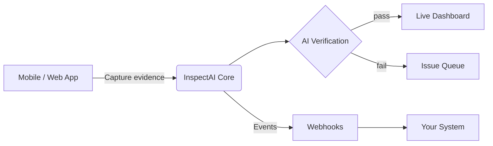

InspectAI is Checkfirst’s AI-powered inspection and audit platform for the Testing, Inspection, Certification & Compliance (TICC) sector. It blends **digital checklists, real-time AI verification, and an API-first architecture** so field teams capture higher-quality evidence while engineering teams pipe structured data straight into existing systems. Customers report up to *5× faster* end-to-end workflows and 25-40 % lower operating costs after deployment.

## Why InspectAI

| Pain point | How InspectAI helps |
|:------------|:---------------------|
| Paper or spreadsheet checklists cause transcription errors | Mobile digital checklists with built-in scoring logic guide inspectors step-by-step. |
| Evidence authenticity is hard to prove | AI verifies images, GPS/EXIF, timestamps & digital signatures on every capture. |
| Reports take weeks to compile | Automated scoring and templated exports generate PDF/JSON reports in minutes. |
| Disparate tools offer no single source of truth | API + webhooks push unified inspection data into ERPs, QMS, or BI stacks. |
| No connectivity in the field | Full offline mode syncs data as soon as a connection returns. |

## Core building blocks

| Entity | Description |
|:--------|:-------------|
| **Checklist** | A version-controlled template that defines required fields, scoring logic, and conditional steps. |
| **Job** | A single execution of a checklist (sometimes called an *inspection run*). |
| **Evidence** | Geotagged photos, files, sensor readings, or text captured during a job. |
| **Issue** | Auto-flagged non-conformities linked to evidence, severity, and resolution workflows. |
| **Report** | Immutable record of the job, issues, signatures, and AI verification results—exportable via API. |

These resources map 1-to-1 to REST endpoints and SDK objects covered in the [API Reference](/api-reference).

## High-level architecture

1. **Capture & verify** – Mobile or web clients use the InspectAI SDK or GraphQL mutations to create Jobs and upload Evidence. Offline mode caches data locally.
2. **AI verification** – Images and structured answers flow through a “smart rules + vision model” pipeline that flags anomalies in < 500 ms.
3. **Live insight** – Dashboards expose KPIs like completion rate, issue density, and mean time-to-resolution.
4. **Integrate** – Webhooks broadcast `job.completed`, `image.flagged`, etc. to your backend; the REST/GraphQL API supports bulk pulls for BI.

## Typical rollout timeline

| Phase      | Duration  | Key actions                                                       |
|:---------- |:--------- | :----------------------------------------------------------------- |
| Discovery  | 1 wk    | Map existing checklists and data flows.                           |
| Prototype  | 1–2 wks | Build first digital checklist, integrate sandbox API.             |
| Pilot      | 2–4 wks | Train field users, run parallel inspections, tweak scoring logic. |
| Production | 1 wk    | Go live; enable alerts and downstream integrations.               |

Most customers hit ROI inside the first quarter thanks to faster job cycles and reduced re-work. ([How InspectAI Makes Audit Workflows up to 5X More Efficient for TICC Companies][4], [Why TICC Businesses Are Choosing InspectAI for Smarter Inspections and Audits][3])

[1]: https://www.checkfirst.ai/inspectai "InspectAI by Checkfirst | AI-Enhanced Inspections"
[2]: https://www.checkfirst.ai/press-release/checkfirst-launches-next-gen-ai-inspection-tool-for-tic-industry "Checkfirst"
[3]: https://www.checkfirst.ai/blog/why-ticc-businesses-choosing-inspectai-for-smarter-inspections-audits "Checkfirst"
[4]: https://www.checkfirst.ai/blog/how-inspectai-audit-workflows-more-efficient-for-ticc-companies "Checkfirst"

