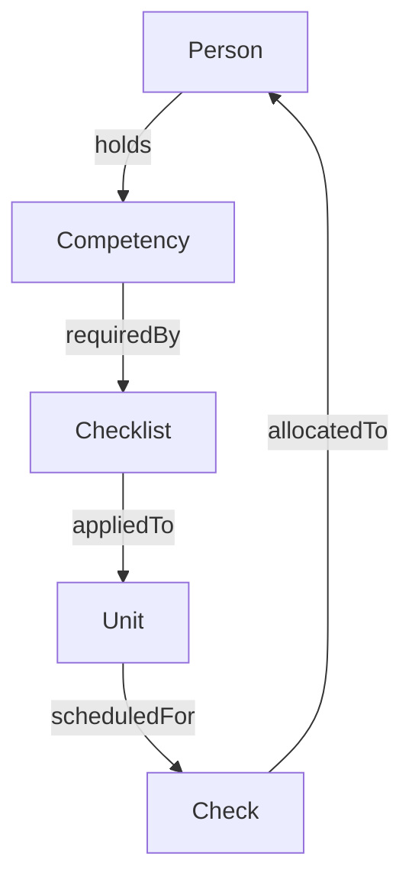

Before you call the API it helps to know the domain objects ScheduleAI works with. Think of these as the nouns of the platform—everything else is an action on, or a relationship between, these resources.

## Glossary

| Term            | What it means                                                                                      | Key attributes                                                          |
| :-------------- | :------------------------------------------------------------------------------------------------- | :---------------------------------------------------------------------- |
| **Unit**        | A physical asset, site or location to be inspected (e.g. wind turbine, warehouse, livestock farm). | `id`, `name`, `geo`, optional custom fields                             |
| **Checklist**   | A reusable template that lists tasks, competencies and time estimates required to inspect a Unit.  | `id`, `title`, `competencies[]`, `duration_minutes`                     |
| **Check (Job)** | A single planned occurrence of *Checklist × Unit* that must be scheduled in a time window.         | `id`, `unitId`, `checklistId`, `window.from/ to`, `priority`            |
| **Person**      | An inspector, auditor or engineer who performs Checks and holds competencies.                      | `id`, `name`, `homeLocation`, `competencies[]`, `availability[]`        |
| **Allocation**  | Assignment of one Person to one Check at a specific start/end time.                                | `id`, `checkId`, `personId`, `startsAt`, `endsAt`                       |
| **Schedule**    | A collection of Allocations optimised for a planning horizon (day, week, month).                   | `id`, `status`, `objective`, `metrics.travelKm`, `metrics.utilisation%` |
| **Report**      | Evidence and metrics generated after work is completed (utilisation, travel, compliance).          | `id`, `type`, `period`, downloadable file links                         |
| **Webhook**     | Outbound HTTP POST triggered by a system event (e.g. `REPORT_CREATED`).                            | `id`, `event`, `targetUrl`, `secret`                                    |


## Object relationships



* A **Checklist** defines what needs to be done.
* A **Unit** is *where* it must be done.
* A **Check** combines both and adds *when* it should happen.
* A **Person** who owns all required competencies can be **Allocated** to the Check.

## Sample payloads

### Create a Check (Job)

```bash
curl -X POST "$BASE/checks" \
  -H "X-API-Key: $SAI_KEY" \
  -H "Content-Type: application/json" \
  -d '{
    "unitId": "unit_8f2e",
    "checklistId": "list_fire_safety",
    "window": {"from": "2025-07-01", "to": "2025-07-31"},
    "priority": "high"
  }'
```

### Example Check object

```json
{
  "id": "chk_01HF1WXNV9B9S9PCZD4C9C6KAM",
  "unitId": "unit_8f2e",
  "checklistId": "list_fire_safety",
  "window": {"from": "2025-07-01T00:00:00Z", "to": "2025-07-31T23:59:59Z"},
  "status": "UNSCHEDULED",
  "priority": "high",
  "createdAt": "2025-05-08T14:20:13Z"
}
```

### Allocation fragment in a Schedule

```json
{
  "allocationId": "alloc_42e1",
  "scheduleId": "sch_JUNE",
  "checkId": "chk_01HF1WXNV9B9S9PCZD4C9C6KAM",
  "personId": "pers_alice",
  "startsAt": "2025-07-15T08:30:00Z",
  "endsAt": "2025-07-15T11:00:00Z",
  "travelKm": 42.5
}
```

## Business constraints (hard vs soft)

* **Hard constraints** – must never be violated (competency match, legal work‑hour limits, geographic availability).
* **Soft constraints** – optimiser minimises these (total travel distance, idle gaps, overtime minutes).

You can tweak objectives when running the scheduler:

```json
{"objective": "min_travel"}
```

Other options:

* `max_utilisation` – maximise paid hours vs available hours.
* `balanced` – hybrid objective with penalty weights on travel and under‑utilisation.

