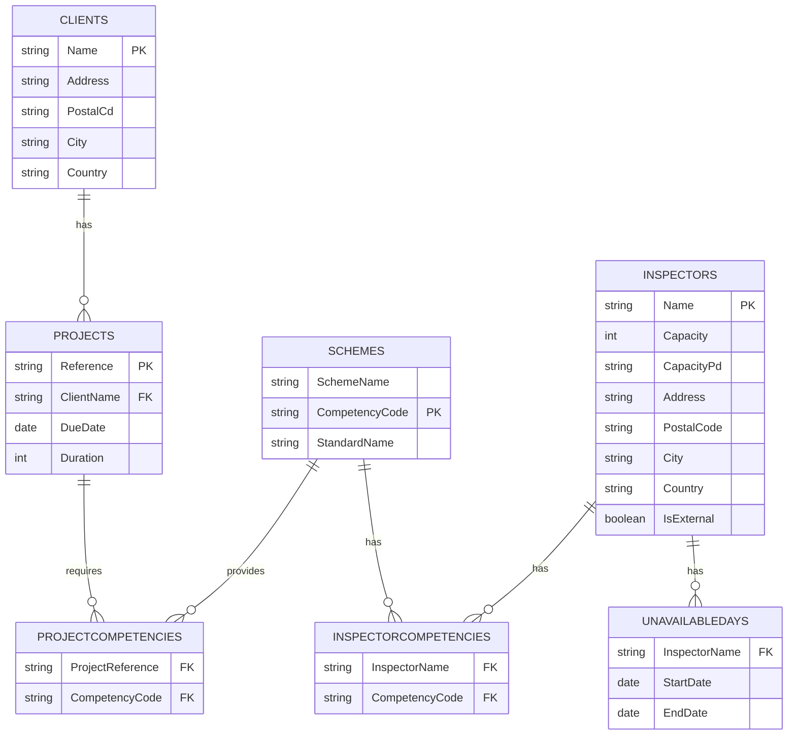

Schedule AI’s **File‑Import** service accepts structured CSV files that match the platform’s underlying data model. All files are uploaded through the endpoints shown below, validated row‑by‑row and processed asynchronously.

> **Important** Endpoint paths are defined in the OpenAPI spec (`/api/v1/file-import/...`), but the *columns* in your CSV **must** match the schemas in this page.

## Entity relationship (high‑level)



## 1. Inspectors

### Required columns

| Column              | Type    | Notes                                                  |        |
| :------------------ | :------ | :----------------------------------------------------- | :----- |
| `Name`              | string  | Primary key                                            |        |
| `Capacity`          | int     | Hours or points—configurable                           |        |
| `CapacityPeriod`    | string  | `DAY`, `WEEK`, `MONTH`                                 |        |
| `Address`           | string  | Street name + number                                   |        |
| `PostalCode`        | string  |                                                        |        |
| `City`              | string  |                                                        |        |
| `Country`           | string  | ISO 3166‑1 alpha‑2                                     |        |
| `Email`             | string  | Optional                                               |        |
| `Phone`             | string  | Optional                                               |        |
| `Role`              | string  | Optional descriptor                                    |        |
| `MaxTravelDistance` | int     | km, optional                                           |        |
| `IsExternal`        | boolean | `true` / `false`                                       |        |
| `UnavailableDates`  | string  | `YYYY‑MM‑DD‒YYYY‑MM‑DD;…` (semicolon‑separated ranges) |        |
| `CompetencyCodes`   | string  | Pipe‑separated list: \`NDT                             | WELD\` |

### Sample file `inspectors.csv`

```csv
Name,Capacity,CapacityPeriod,Address,PostalCode,City,Country,Email,Phone,Role,MaxTravelDistance,IsExternal,UnavailableDates,CompetencyCodes
Alice Smith,40,WEEK,1 High St,SW1A 1AA,London,GB,alice@example.com,+44 20 1234 5678,Senior,300,false,2025‑07‑10‒2025‑07‑14,NDT|WELD
Bob Lee,8,DAY,99 King Rd,M1 2AB,Manchester,GB,bob@example.com,,Contractor,,true,,WELD
```

> *Behind the scenes* the service splits `UnavailableDates` into the **UNAVAILABLEDAYS** table and each competency into **INSPECTORCOMPETENCIES**.

## 2. Projects (a.k.a. Client projects)

### Required columns

| Column                | Type    | Notes                                    |
| :-------------------- | :------ | :--------------------------------------- |
| `Reference`           | string  | Primary key                              |
| `ClientName`          | string  | FK → `CLIENTS.Name` (created on‑the‑fly) |
| `Address`             | string  |                                          |
| `PostalCode`          | string  |                                          |
| `City`                | string  |                                          |
| `Country`             | string  |                                          |
| `DueDate`             | date    | `YYYY‑MM‑DD`                             |
| `TargetMonth`         | string  | Optional, `YYYY‑MM`                      |
| `IsPriority`          | boolean | `true` / `false`                         |
| `DurationDays`        | int     | Whole‑day granularity                    |
| `CompetencyCodes`     | string  | Pipe list                                |
| `PreferredInspectors` | string  | Pipe list of `Inspectors.Name`           |
| `ExcludedInspectors`  | string  | Pipe list                                |

### Sample file `projects.csv`

```csv
Reference,ClientName,Address,PostalCode,City,Country,DueDate,TargetMonth,IsPriority,DurationDays,CompetencyCodes,PreferredInspectors,ExcludedInspectors
PRJ‑1001,Acme Corp,12 Market St,2000,Sydney,AU,2025‑08‑15,2025‑08,false,2,NDT|ISO9001,Alice Smith,
PRJ‑1002,Globex Ltd,88 Harbour Dr,1010,Auckland,NZ,2025‑09‑05,,true,3,WELD,,Bob Lee
```

`CompetencyCodes` are exploded into **PROJECTCOMPETENCIES** after upload.

## 3. Schemes (optional)

Used when you run recurring inspections based on certification schemes/standards.

### Required columns

| Column                 | Type   | Notes                      |
| :--------------------- | :----- | :------------------------- |
| `SchemeName`           | string | Primary key                |
| `CompetencyCode`       | string |                            |
| `StandardName`         | string | e.g. `ISO 45001`           |
| `Periodicity`          | string | `ANNUAL`, `BIENNIAL`, etc. |
| `CompletionWindowDays` | int    | Grace period               |
| `RotationMonths`       | int    | Cycle length               |

### Simplified template `schemes.csv`

```csv
SchemeName,CompetencyCode,StandardName,CompletionWindowDays,RotationMonths
Fire Safety AUD,NDT,ISO 45001,30,12
Structural Weld,WELD,AWS D1.1,15,6
```

## Upload workflow (all files)

```bash
curl -X POST "$BASE/file-import/upload/inspectors" \
  -H "X-API-Key: $SAI_KEY" \
  -F file=@inspectors.csv
```

Successful responses return JSON:

```json
{
  "importId": "imp_01HTS6R2MZJ8D1XWG2Q6GJ0QGQ",
  "state": "PENDING"
}
```

Poll `GET /file-import/{importId}/status` until `state` becomes `SUCCESS` or `FAILED`. Validation errors are attached per row.

## Exporting analytics reports

Exports are **read‑only** and unaffected by the import schema above. Refer to the spec for endpoints under `/api/v1/reports/*`.

## Inspector Sync

- Option 1: Provide a link to a file including all inspectors
- Option 2: Provide an endpoint including all inspectors

## FAQs

**Why separate competencies and unavailable days instead of embedding?**
This normalises the data and lets the optimiser query competencies and availability efficiently without JSON parsing.

**Can I send XLSX?**
The service currently supports CSV only; convert XLSX beforehand.

**What happens to unknown columns?**
They are ignored but logged under the job’s `warnings` array.

