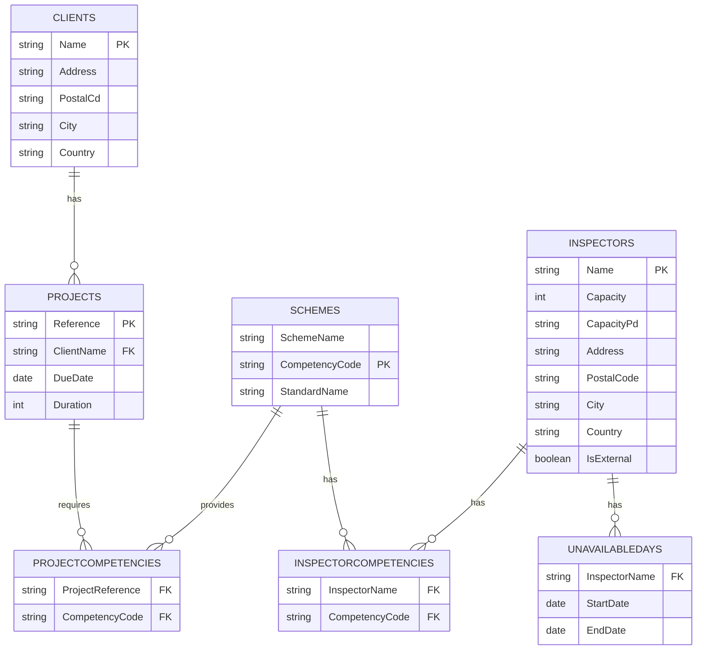

Get your ScheduleAI proof of concept up and running quickly with these simplified steps. This minimal path demonstrates core functionality while bypassing detailed setup.


## Entity relationship (high‑level)



## Load auditors

```bash
# Option 1: API method - Add a single auditor with required competencies
curl -X POST "https://schedule.checkfirst.ai/api/v1/people" \
  -H "X-API-Key: $SAI_KEY" \
  -H "Content-Type: application/json" \
  -d '{
    "name": "Alice Smith",
    "competencies": ["NDT", "WELD"],
    "homeLocation": "GB-LDN",
    "capacity": 40,
    "capacityPeriod": "WEEK"
  }'

# Option 2: CSV import - For bulk loading (recommended for POCs)
curl -X POST "https://schedule.checkfirst.ai/api/v1/people/import" \
  -H "X-API-Key: $SAI_KEY" \
  -F file=@inspectors.csv
```


### Required columns

| Column              | Type    | Notes                                                  |        |
| :------------------ | :------ | :----------------------------------------------------- | :----- |
| `Name`              | string  | Primary key                                            |        |
| `Capacity`          | int     | Hours or points—configurable                           |        |
| `CapacityPeriod`    | string  | `DAY`, `WEEK`, `MONTH`                                 |        |
| `Address`           | string  | Street name + number                                   |        |
| `PostalCode`        | string  |                                                        |        |
| `City`              | string  |                                                        |        |
| `Country`           | string  | ISO 3166‑1 alpha‑2                                     |        |
| `Email`             | string  | Optional                                               |        |
| `Phone`             | string  | Optional                                               |        |
| `Role`              | string  | Optional descriptor                                    |        |
| `MaxTravelDistance` | int     | km, optional                                           |        |
| `IsExternal`        | boolean | `true` / `false`                                       |        |
| `UnavailableDates`  | string  | `YYYY‑MM‑DD‒YYYY‑MM‑DD;…` (semicolon‑separated ranges) |        |
| `CompetencyCodes`   | string  | Pipe‑separated list: \`NDT                             | WELD\` |

### Sample file `inspectors.csv`

```csv
Name,Capacity,CapacityPeriod,Address,PostalCode,City,Country,Email,Phone,Role,MaxTravelDistance,IsExternal,UnavailableDates,CompetencyCodes
Alice Smith,40,WEEK,1 High St,SW1A 1AA,London,GB,alice@example.com,+44 20 1234 5678,Senior,300,false,2025‑07‑10‒2025‑07‑14,NDT|WELD
Bob Lee,8,DAY,99 King Rd,M1 2AB,Manchester,GB,bob@example.com,,Contractor,,true,,WELD
```

## Load projects

```bash
# Option 1: API method - Add individual project
curl -X POST "https://schedule.checkfirst.ai/api/v1/projects" \
  -H "X-API-Key: $SAI_KEY" \
  -H "Content-Type: application/json" \
  -d '{
    "reference": "POC-1001",
    "clientName": "Demo Client",
    "dueDate": "2025-06-30",
    "competencyCodes": ["NDT"],
    "durationDays": 2,
    "isPriority": true
  }'

# Option 2: CSV import - For multiple projects at once
curl -X POST "https://schedule.checkfirst.ai/api/v1/projects/import" \
  -H "X-API-Key: $SAI_KEY" \
  -F file=@projects.csv
```

### Required columns

| Column                | Type    | Notes                                    |
| :-------------------- | :------ | :--------------------------------------- |
| `Reference`           | string  | Primary key                              |
| `ClientName`          | string  | FK → `CLIENTS.Name` (created on‑the‑fly) |
| `Address`             | string  |                                          |
| `PostalCode`          | string  |                                          |
| `City`                | string  |                                          |
| `Country`             | string  |                                          |
| `DueDate`             | date    | `YYYY‑MM‑DD`                             |
| `TargetMonth`         | string  | Optional, `YYYY‑MM`                      |
| `IsPriority`          | boolean | `true` / `false`                         |
| `DurationDays`        | int     | Whole‑day granularity                    |
| `CompetencyCodes`     | string  | Pipe list                                |
| `PreferredInspectors` | string  | Pipe list of `Inspectors.Name`           |
| `ExcludedInspectors`  | string  | Pipe list                                |

### Sample file `projects.csv`

```csv
Reference,ClientName,Address,PostalCode,City,Country,DueDate,TargetMonth,IsPriority,DurationDays,CompetencyCodes,PreferredInspectors,ExcludedInspectors
PRJ‑1001,Acme Corp,12 Market St,2000,Sydney,AU,2025‑08‑15,2025‑08,false,2,NDT|ISO9001,Alice Smith,
PRJ‑1002,Globex Ltd,88 Harbour Dr,1010,Auckland,NZ,2025‑09‑05,,true,3,WELD,,Bob Lee
```

Used when you run recurring inspections based on certification schemes/standards.

### Required columns

| Column                 | Type   | Notes                      |
| :--------------------- | :----- | :------------------------- |
| `SchemeName`           | string | Primary key                |
| `CompetencyCode`       | string |                            |
| `StandardName`         | string | e.g. `ISO 45001`           |
| `Periodicity`          | string | `ANNUAL`, `BIENNIAL`, etc. |
| `CompletionWindowDays` | int    | Grace period               |
| `RotationMonths`       | int    | Cycle length               |

### Simplified template `schemes.csv`

```csv
SchemeName,CompetencyCode,StandardName,CompletionWindowDays,RotationMonths
Fire Safety AUD,NDT,ISO 45001,30,12
Structural Weld,WELD,AWS D1.1,15,6
```


## Schedule with AI

```bash
# Run the scheduler with minimal parameters
curl -X POST "https://schedule.checkfirst.ai/api/v1/schedules" \
  -H "X-API-Key: $SAI_KEY" \
  -H "Content-Type: application/json" \
  -d '{
    "window": {"from": "2025-06-01", "to": "2025-06-30"},
    "objective": "balanced"
  }'
```

The response includes a `scheduleId` you'll need for the next step:

```json
{
  "id": "sch_2025_JUNE",
  "status": "PENDING",
  "objective": "balanced",
  "createdAt": "2025-05-08T15:40:22Z"
}
```

For POCs with 10-15 projects, scheduling typically completes within seconds.

## Review results

```bash
# Check schedule status (poll until "COMPLETED")
curl "https://schedule.checkfirst.ai/api/v1/schedules/sch_2025_JUNE" \
  -H "X-API-Key: $SAI_KEY"

# Get utilization report
curl -L "https://schedule.checkfirst.ai/api/v1/reports/utilisation?month=2025-06" \
  -H "X-API-Key: $SAI_KEY" -o poc_utilisation.xlsx

# View allocations
curl "https://schedule.checkfirst.ai/api/v1/schedules/sch_2025_JUNE/allocations" \
  -H "X-API-Key: $SAI_KEY"
```

Key metrics to evaluate your POC:
- **Utilization %**: How efficiently auditor time is allocated
- **Constraint satisfaction**: All competency requirements met
- **Travel optimization**: Total distance compared to manual scheduling
- **Priority adherence**: High-priority projects scheduled first

For additional insights, download full schedule data and compare multiple scheduling objectives (`min_travel` vs `max_utilisation`).
